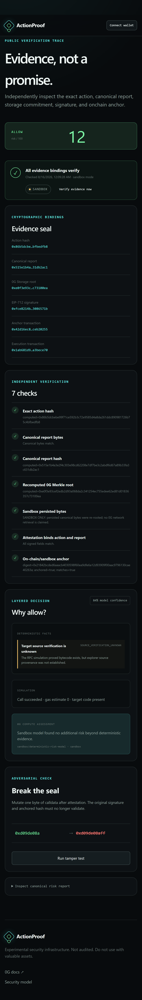
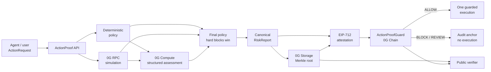

# ActionProof

**Proof before action.**

ActionProof is a verifiable runtime firewall that analyzes, simulates, attests, and audits
autonomous AI-agent transactions before execution on 0G.

[](https://github.com/tang-vu/actionproof-0g/actions/workflows/ci.yml)
[](LICENSE)
[](https://0g.ai/)

> [!WARNING]
> ActionProof is experimental security infrastructure, has not been audited, and does not guarantee
> transaction safety. Use only the included valueless demo contracts—not valuable assets.

## Why this exists

An autonomous agent's sentence—“approve the operator”—is not its transaction. The calldata may grant
an unlimited allowance, change an owner, upgrade a proxy, or target the wrong chain. A second model
saying “looks safe” is useful context, but it cannot be the enforcement boundary.

ActionProof turns a proposed action into independently checkable evidence:

1. deterministic rules extract reproducible facts and hard blocks;
2. `eth_call` preflight records whether the exact downstream call succeeds;
3. a real 0G Compute path returns a strictly validated, advisory risk assessment;
4. the complete canonical report is committed to 0G Storage;
5. EIP-712 binds the exact action, report hash, Storage root, chain, guard, nonce, and deadline;
6. a minimal contract anchors every verdict and executes an allow action once—or refuses it;
7. a public trace retrieves and re-verifies the complete chain of evidence.

The model can make a decision stricter. It can never clear a deterministic block.


_Screenshot is rendered from the checked-in application in explicit sandbox mode. Live mode uses the
same UI but only shows 0G receipts returned by real adapters._



_The same public verification and tamper workflow is exercised on the Pixel 7 Playwright viewport._

## Architecture



The monorepo keeps those boundaries explicit:

```text
apps/web              Next.js judge console and public verification traces
apps/api              Fastify job pipeline, persistence, demos, live smoke boundary
packages/core         schemas, canonicalization, hashing, EIP-712, deterministic policy
packages/0g           typed Chain / Compute / Storage adapters + explicit sandbox adapters
packages/contracts    Foundry guard, valueless fixtures, fuzz/security tests, deploy scripts
docs                   research, threat model, deployment, demo, pitch, submission evidence
```

Read [ARCHITECTURE.md](docs/ARCHITECTURE.md) for exact hashes, state transitions, trust boundaries,
and policy semantics.

## Real 0G integration

### 0G Chain

`ActionProofGuard` is a small, non-upgradeable EVM contract. It implements:

- shared Solidity/TypeScript action-request hashing;
- EIP-712 signing bound to chain ID and deployed guard address;
- authorized verifier rotation with verifier-at-anchor preservation;
- exact target, value, calldata, intent, report root/hash, agent, requester, nonce, and time binding;
- sequential `(agent, requester)` nonce lanes and distinct anchor/execution replay barriers;
- report-only anchors for allow, block, and review verdicts;
- allow-only guarded execution, checks-effects-interactions, reentrancy protection, and exact revert
  propagation;
- event-based public audit history.

| Network | Chain ID | Guard                                                                                               | Demo Counter                                                                                        | Demo Token                                                                                          | Status                       |
| ------- | -------: | --------------------------------------------------------------------------------------------------- | --------------------------------------------------------------------------------------------------- | --------------------------------------------------------------------------------------------------- | ---------------------------- |
| Galileo |  `16602` | [`0xAE7b…7d5e`](https://chainscan-galileo.0g.ai/address/0xae7bb700296d25fc4fb2ec3dbccda8348f3b7d5e) | [`0xdDEF…4961`](https://chainscan-galileo.0g.ai/address/0xddefa8aace574f30b4f6db972df4df11ec524961) | [`0x5f54…89bf`](https://chainscan-galileo.0g.ai/address/0x5f54d66a5dd8dceb1a5edcc638b31839810589bf) | Deployed and source-verified |
| Mainnet |  `16661` | Not deployed                                                                                        | Not deployed                                                                                        | Not deployed                                                                                        | Broadcast disabled           |

The Galileo contracts were broadcast on 2026-08-15 and independently source-verified. Exact
deployment transactions, blocks, compiler settings, and all four fixture addresses are committed in
[`galileo.json`](packages/contracts/deployments/galileo.json).

### 0G Compute

The production adapter uses the officially recommended server-side **0G Compute Router** through its
OpenAI-compatible endpoint. It requires JSON-object mode, response byte/time limits, `x_0g_trace`
request/provider/billing metadata, and a strict Zod schema. Malformed output, missing trace data,
timeout, unsupported capability, or transport failure stops the pipeline. Live mode never falls back
to a fake model.

The current Direct SDK alternative (`@0gfoundation/0g-compute-ts-sdk@0.9.0`) and upstream drift are
recorded in [RESEARCH.md](docs/RESEARCH.md).

The live Galileo proof used `qwen2.5-omni`, provider
`0xa48f01287233509FD694a22Bf840225062E67836`, and retains Router request IDs in the signed reports.

### 0G Storage

The production adapter pins `@0gfoundation/0g-storage-ts-sdk@1.2.11` and `ethers@6.13.1`. It uploads
the exact canonical report bytes through a Turbo indexer, checks the returned root, downloads the
object, compares bytes, parses/recanonicalizes it, and independently recomputes the SDK Merkle root.
That final check is mandatory because the current high-level downloader proof option is not by
itself sufficient evidence of proof validation. Receipts preserve the Storage submission sequence
and expose its direct StorageScan link; finalized deduplication is valid even when no new transaction
hash is returned.

## Verified Galileo evidence

The checked-in [live evidence record](docs/evidence/galileo-live.json) was produced by the real
production adapters on 2026-08-15:

- **Safe:** [Storage sequence 146933](https://storagescan-galileo.0g.ai/submission/146933),
  [anchor](https://chainscan-galileo.0g.ai/tx/0xdf92eeafe30634018a05106c05b437d514b713fae1fb893d05c569f0d5d5b3d8),
  and [guarded execution](https://chainscan-galileo.0g.ai/tx/0x0ac9679df0f9e260e0b0055983bf18552d7ae45dffd81ad16b2ae92fca153491).
- **Dangerous:** unlimited approval produced risk `100`, rule `UNLIMITED_ERC20_APPROVAL`,
  [Storage sequence 146934](https://storagescan-galileo.0g.ai/submission/146934), and an
  [audit-only block anchor](https://chainscan-galileo.0g.ai/tx/0x2ed9f81dd07e7a5dbc71d5ed271f90cdf5da5e0e3e35e34462349f7c4b2627c0)
  with no execution transaction.
- **Tamper:** changing the safe calldata made both the action-hash and attestation-binding checks
  fail. The final counter state was `2`; the evidence run advanced the nonce lane to `5`.

### Agentic ID

ActionProof optionally resolves an official ERC-8004 `agentId` from the published Identity Registry,
reads `ownerOf`, `getAgentWallet`, and `tokenURI`, and binds that evidence into the canonical report.
The registered wallet must equal the exact action-agent address or deterministic policy blocks the
action. Resolution is read-only; registration is deliberately outside the automatic flow. ERC-7857
remains deferred because its current production oracle/re-encryption path is not suitable for this
firewall's critical path.

## Quick start

Prerequisites: Node.js 22+, pnpm 11.20.0, and Foundry 1.7.1.

```bash
git clone https://github.com/tang-vu/actionproof-0g.git
cd actionproof-0g
corepack enable
pnpm install
cp .env.example .env
pnpm dev
```

Open `http://127.0.0.1:3000`. The safe default is the unmistakably labeled sandbox; it makes no paid
calls and no onchain claims.

Windows PowerShell:

```powershell
Copy-Item .env.example .env
pnpm dev
```

For isolated Galileo testnet identities, generate or preserve the four server keys directly in the
ignored local `.env` without printing private keys:

```powershell
pnpm bootstrap:testnet
```

This does not request faucet funds, create a Compute account, enable writes, or broadcast anything.

The web app runs on port `3000`; the API runs on `8787`.

## Reproducible demo

Run all three terminal scenarios:

```bash
pnpm demo
```

- **Safe:** a valueless counter increment is analyzed, anchored, and executed.
- **Dangerous:** `approve(spender, uint256.max)` raises `UNLIMITED_ERC20_APPROVAL`, anchors a block,
  and never executes.
- **Tamper:** altered calldata/report binding fails verification; replay/duplicate execution are also
  contract-tested.

For the browser story, run `pnpm dev`, open **Analyze**, and follow
[the three-minute demo script](docs/DEMO_SCRIPT.md).

An authorized, funded Galileo operator can reproduce the paid production-adapter flow with:

```bash
pnpm readiness:live             # no paid inference/write
pnpm demo:live                  # safe + dangerous + tamper; spends testnet 0G
pnpm demo:live -- safe          # one paid safe scenario + tamper
pnpm demo:live -- block         # one paid block scenario + tamper
```

Live traces persist under the ignored `API_DATA_DIR`; `pnpm dev` serves them through the same public
verification UI.

## Verification

```bash
pnpm verify
```

This single command runs formatting, ESLint, strict TypeScript, unit/integration tests, 512-run
Foundry fuzz tests, production builds, a repository-file secret scan, a high-severity production
dependency audit, and the critical Playwright journey on desktop and mobile. CI runs the same
deterministic checks and never spends funds.

Individual commands:

```bash
pnpm format:check
pnpm lint
pnpm typecheck
pnpm test
pnpm test:contracts
pnpm build
pnpm test:e2e
pnpm audit:prod
pnpm probe:0g        # public Chain/Compute-catalog/Storage-indexer probes; no keys or spend
pnpm readiness:live  # configured model/indexer/guard/verifier checks; no paid inference or write
pnpm test:live       # opt-in configuration/readiness checks; no implicit spending
```

## Live Galileo setup

Live mode needs:

1. a funded Galileo deployer/storage/relayer account;
2. a dedicated verifier key;
3. a funded testnet Compute Router balance and inference-only `sk-` key;
4. a currently listed JSON-capable model;
5. deployed and verified guard/demo addresses;
6. `ENABLE_LIVE_WRITES=true` after dry-run review.

Put keys only in a local `.env` or secret manager. Never prefix secrets with `NEXT_PUBLIC_`, commit
them, or paste them into chat. Mainnet also needs `ALLOW_MAINNET_BROADCAST=true` and explicit human
authorization. See [DEPLOYMENT.md](docs/DEPLOYMENT.md) for exact dry-run, verification, readiness,
rollback, and recovery steps.

## Security posture

The main invariants and attacks are documented in [THREAT_MODEL.md](docs/THREAT_MODEL.md). Important
limits:

- selector and bytecode scans are useful heuristics, not complete semantic analysis;
- simulation is a state snapshot and can differ from later execution;
- model correctness, confidence, or TEE provenance is not a safety proof;
- verifier, owner, host, RPC, and upstream chain compromise remain material trust-root failures;
- JSON persistence and single-process jobs are MVP infrastructure, not production HA;
- reports are public and no confidential-evidence mode is included;
- no audit or formal verification has occurred.

Please report vulnerabilities privately as described in [SECURITY.md](SECURITY.md).

## Documentation

- [0G research and decisions](docs/RESEARCH.md)
- [Architecture](docs/ARCHITECTURE.md)
- [Threat model](docs/THREAT_MODEL.md)
- [Three-minute demo](docs/DEMO_SCRIPT.md)
- [Deployment and mainnet checklist](docs/DEPLOYMENT.md)
- [Build log](docs/BUILD_LOG.md)
- [Judging evidence map](docs/JUDGING_MAP.md)
- [Submission package](docs/SUBMISSION.md)
- [Pitch deck source](docs/PITCH.md)

## Roadmap

1. Independent contract/application audit and KMS-backed threshold verification.
2. Richer trace/state-diff simulation and protocol-aware policy modules.
3. Durable queue/database, guard event indexer, monitoring, and redundant RPCs.
4. Optional ERC-8004 reputation evidence; ERC-7857 only after its production oracle path is proven.

No token, NFT sale, DAO, marketplace, custody feature, or unrelated chat product is planned.

## Contributing and license

Focused security, policy, integration, accessibility, testing, and documentation contributions are
welcome. See [CONTRIBUTING.md](CONTRIBUTING.md).

ActionProof is released under the [MIT License](LICENSE).
