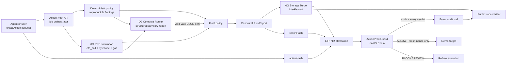
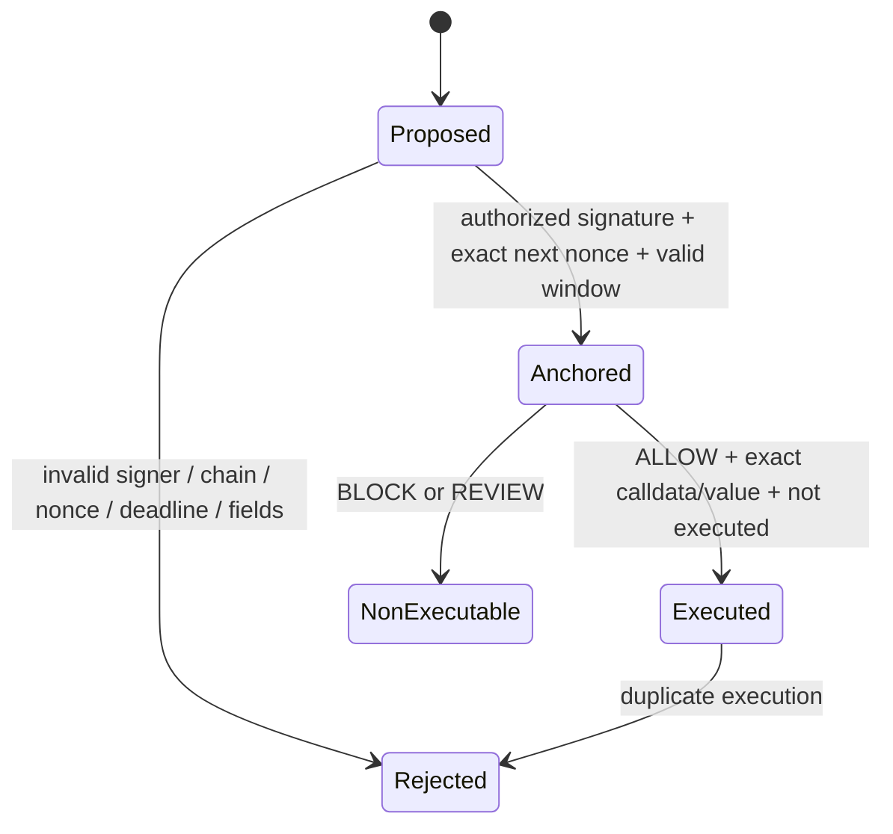

# Architecture

ActionProof is a pre-execution evidence pipeline and a minimal onchain enforcement point. It does
not ask a model whether a transaction is "safe" and then trust the answer. It creates independent
facts, records an advisory model assessment, binds both to the exact proposed action, and lets a
small Solidity guard enforce only the properties that can be checked onchain.

## System view



The browser never receives a private key or a Compute API key. It proposes an exact envelope,
polls an asynchronous job, and renders receipts returned by the API. In live mode the API holds only
server-side verifier/relayer/storage credentials supplied through its secret environment. A live
API write also requires a separate operator bearer token. The supervised UI holds that token only
in component memory; it is not placed in a public environment variable, URL, browser storage, or
log.

## Repository boundaries

| Package              | Responsibility                                                                      | Security boundary                                   |
| -------------------- | ----------------------------------------------------------------------------------- | --------------------------------------------------- |
| `apps/web`           | Wallet/demo entry, real pipeline states, verdicts, trace verification, history      | Untrusted presentation client; no server secrets    |
| `apps/api`           | Validation, orchestration, persistence, rate limits, failure handling, demo CLI     | Only process allowed to coordinate funded services  |
| `packages/core`      | Schemas, canonical JSON, action/report hashing, deterministic policy, EIP-712 types | Pure, deterministic logic shared by every runtime   |
| `packages/0g`        | Typed Chain, Compute Router, and Storage adapters plus explicit sandbox adapters    | Every network response is untrusted and revalidated |
| `packages/contracts` | EIP-712 verification, evidence anchors, sequential nonces, single execution         | Minimal irreversible enforcement surface            |

## Exact action model

`ActionRequest` version 1 contains:

- `agent`: the autonomous actor identity/address;
- `requester`: the principal requesting protection;
- `target`, `value`, and exact `calldata`;
- a human-readable `intent`;
- `destinationChainId`;
- a nonce lane scoped by `(agent, requester)`;
- `issuedAt` and `expiresAt` Unix timestamps.

The request hash is:

```text
keccak256(abi.encode(
  ACTION_REQUEST_TYPEHASH,
  agent,
  requester,
  target,
  value,
  keccak256(calldata),
  keccak256(bytes(intent)),
  destinationChainId,
  nonce,
  issuedAt,
  expiresAt
))
```

Changing one bound field changes `actionHash` before any model or storage operation is considered.

## Instant Preflight boundary

`POST /v1/preflight` is a separate, read-only product path for arbitrary exact action envelopes. It
reuses the same action schema and hash, resolves the current nonce and optional ERC-8004 wallet,
simulates from the guard address, decodes supported selectors, and runs deterministic policy. It
returns `pass`, `review`, or `block` plus structured findings and the exact analysis boundary.

Preflight never calls 0G Compute, uploads to Storage, signs an attestation, persists a trace, sends a
transaction, or executes the target. It is an early integration gate, not proof. Only an unchanged
envelope that enters the full pipeline can produce the evidence and enforcement described below.

## Evidence construction

The API validates the action, simulates from the guard address (the actual downstream `msg.sender`),
and runs deterministic rules. It sends the validated facts—not credentials or a signing instruction—
to 0G Compute. The model object is parsed once and validated strictly. Unknown keys, missing fields,
an out-of-range score, invalid JSON, missing 0G trace metadata, timeout, or transport error ends the
job without an approval.

The complete report includes:

- the exact action and action hash;
- deterministic findings;
- RPC simulation result and effects;
- the model-authored assessment;
- 0G Compute model/provider/request/billing metadata returned by Router;
- final enforced policy, blocking rule IDs, score, confidence, and limitations;
- timestamps and schema/policy versions.

Keys are recursively sorted and serialized as whitespace-free UTF-8 JSON. `reportHash` is
`keccak256(canonicalBytes)`. The same bytes are uploaded to 0G Storage; its Merkle root is recomputed
before upload and after retrieval. The Storage SDK's high-level proof flag is not treated as adequate
proof by itself; see [RESEARCH.md](RESEARCH.md).

## EIP-712 attestation

The verifier signs `ActionAttestation` using this domain:

```text
name: ActionProof
version: 1
chainId: destination chain
verifyingContract: deployed ActionProofGuard
```

The struct binds agent, requester, target, value, calldata hash, intent hash, report root, report
hash, verdict code, destination chain, nonce, issuance, and expiration. The domain supplies an
additional chain and contract binding. Both are intentional defense in depth.

The onchain lifecycle is split:



Anchoring consumes the sequential nonce and emits the evidence root for every verdict. Execution is
a separate transaction, checks the existing anchor and original stored verifier, and can happen once.
This preserves a public blocked-action history without accidentally making a blocked action usable.
Calls may be relayed because the exact authorized action is fully bound; relayers cannot change its
destination, data, value, report, or validity window.

## Decision policy

Policy version `actionproof-policy/1` is intentionally simple and reproducible:

1. Any blocking deterministic finding yields `block`.
2. Otherwise an AI `block` or score at least 75 yields `block`.
3. Otherwise an AI `review` or score at least 45 yields `review`.
4. Only the remaining case yields `allow`.
5. The final score is never lower than the deterministic severity floor.

The model can make a result stricter; it cannot clear a deterministic block. Policy logs the exact
rule IDs responsible for the enforced result.

Implemented deterministic coverage includes unlimited approvals, denied spenders, collection-wide
approvals, ownership/admin/proxy selectors, delegated-call selectors, zero targets/recipients, native
value limits, allowlists, chain/deadline/duplicate checks, missing target code, unverified-source
warnings, simulation failure, unexpected effects, and a labeled bytecode `DELEGATECALL` heuristic.
Selector and opcode matching are explicitly not complete semantic analysis.

## Runtime modes

`ACTIONPROOF_MODE=live` constructs only real 0G adapters and fails startup/readiness when required
configuration is absent. It never silently instantiates sandbox services. `ENABLE_LIVE_WRITES=true`
is required for paid Storage and Chain writes. Live `POST /v1/jobs` then requires a constant-time
match against the server-only `ACTIONPROOF_OPERATOR_TOKEN`; a missing server token fails closed.
Mainnet additionally requires `ALLOW_MAINNET_BROADCAST=true`.

Live `/ready` and `/v1/integrations` run cached, bounded, read-only probes rather than inferring
availability from environment variables. They verify RPC chain/block access, the public Compute
model catalog and configured model, Storage indexer node selection, deployed guard bytecode, and the
guard's authorized verifier. `pnpm probe:0g` checks the three public network surfaces on Galileo and
Mainnet without keys or spend.

When `OG_AGENTIC_ID` is set, the API also resolves the official ERC-8004 Identity Registry and binds
the owner, registered agent wallet, token URI, registry, and chain into the canonical report. Exact
wallet mismatch or resolution failure is a deterministic block. The optional identity probe affects
readiness only when identity enforcement is configured.

`ACTIONPROOF_MODE=sandbox` is for tests and local product inspection. It uses an in-memory chain,
the real 0G SDK Merkle implementation, an ephemeral EIP-712 signer, and a deterministic advisory
assessment. Every response, receipt, UI badge, and trace says `sandbox`; synthetic transaction hashes
are not linked to explorers or described as 0G transactions.

## Persistence and public verification

The MVP uses an append/update JSON file store under `apps/api/data` or an explicitly configured data
directory. Writes are serialized and atomically renamed, and identifiers are validated before path
use. This is sufficient for a single demo instance, not horizontal production deployment.

A trace verifies:

- action schema and recomputed action hash;
- report schema, canonical bytes, and recomputed report hash;
- downloaded storage bytes and recomputed 0G Merkle root;
- attestation fields against the exact action and report;
- EIP-712 signer/domain;
- onchain digest, anchor fields, and execution state in live mode;
- timestamps, chain, and explorer receipts.

The trace page actively calls the server verifier again when opened and offers a manual refresh. Its
tamper action changes one bound field locally and calls the same verifier. A valid result after
mutation is treated as a critical product failure, not a successful demo.

## Scaling path

For production, replace JSON persistence with a transactional database and durable queue; move
signing keys to a KMS/HSM; use redundant managed RPCs; index guard events; separate storage, verifier,
and relayer keys; add contract and application audits; add trace availability monitoring; and adopt a
versioned policy governance process. None of those future controls are claimed by this MVP.
